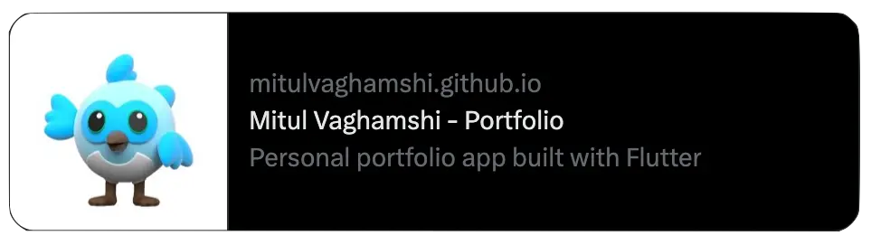
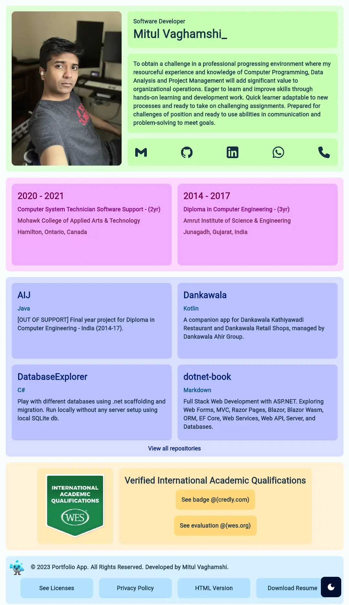
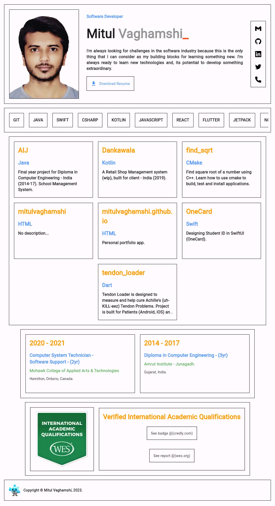
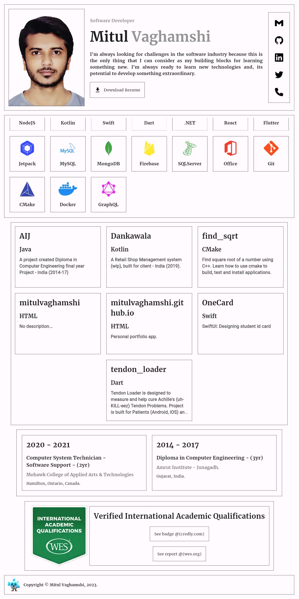
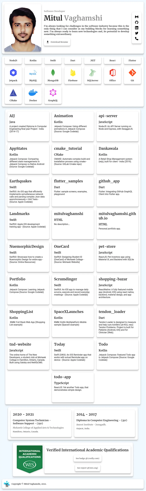

# Mitul Vaghamshi - Portfolio

## Screenshots

| Ver | Screenshot                           |
| --- | ------------------------------------ |
| v7  | [light mode](#v7-light-mode)         |
| v7  | [dark mode](#v7-dark-mode)           |
| v6  | [rounded](#v6-rounded)               |
| v5  | [square colored](#v5-square-colored) |
| v4  | [square b/w](#v4-square-bw)          |
| v3  | [border less](#v3-border-less)       |
| v2  | [elevated](#v2-elevated)             |
| v1  | [initial](#v1-initial)               |

## v7 light mode

## v7 dark mode

## v6 rounded

## v5 square colored

## v4 square b/w

## v3 border less

## v2 elevated

## v1 initial

