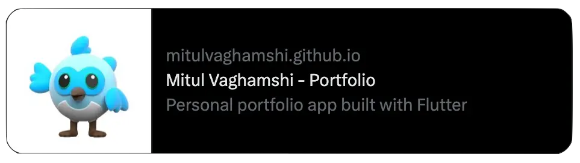

# Mitul Vaghamshi - Portfolio

## Screenshots

| V7a                          | V7b                         | V6                               | V5                               | V4                          | V3                           | V2                         | V1                        |
| ---------------------------- | --------------------------- | -------------------------------- | -------------------------------- | --------------------------- | ---------------------------- | -------------------------- | ------------------------- |
| [LightMode](assets/v7b.webp) | [DarkMode](assets/v7a.webp) | [RoundedCorners](assets/v6.webp) | [SquaredColored](assets/v5.webp) | [SquaredBW](assets/v4.webp) | [Borderless](assets/v3.webp) | [Elevated](assets/v2.webp) | [Initial](assets/v1.webp) |
